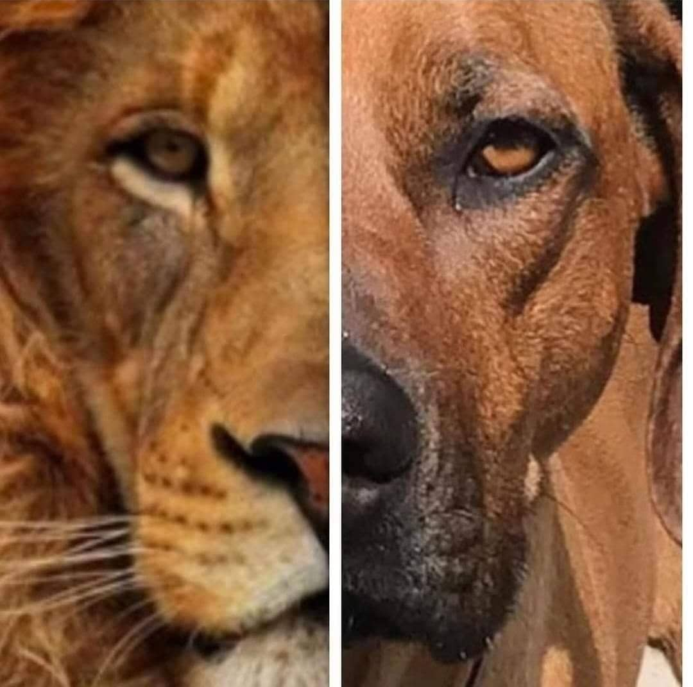
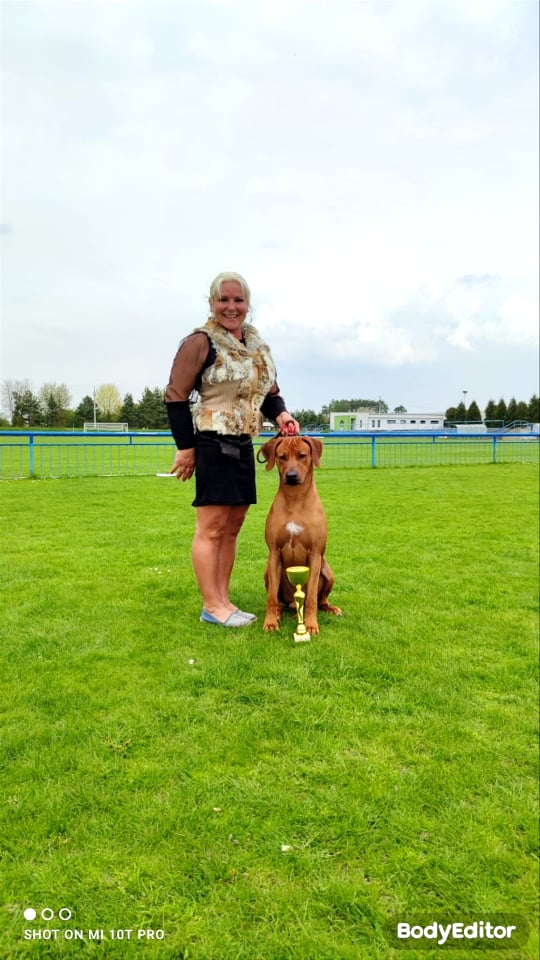
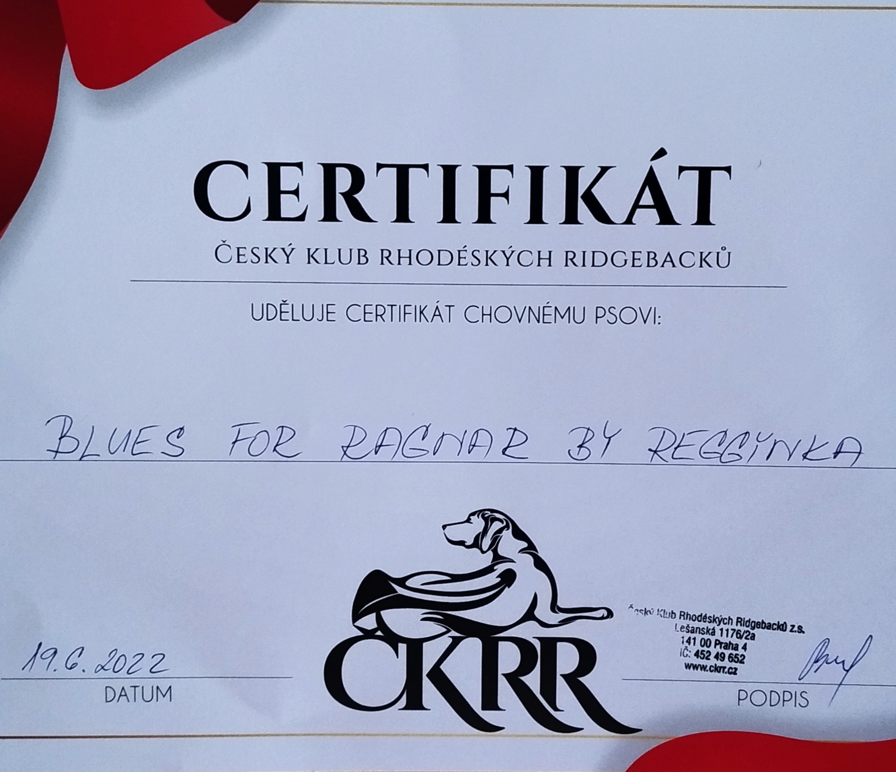

Source URL: https://ridgebackragnar.cz/bez-n%C3%A1zvu-1/

# Bez názvu 1

- Úvodní stránka
- Ocenění
- Galerie
- O nás
- Kontakt
Víte že pes je nejlepší přítel člověka? Ano, pes je opravdu nejlepší přítel člověka. Sice vás nepohladí jako druhý člověk, ale za to je věrným společníkem. Pes vás nikdy nezradí, ale za svoji věrnost taky něco vyžaduje. A to lásku. Psovi se můžete svěřit se svým trápením aniž by jste se museli bát, že něco vyzradí. Z vlastní zkušenosti vím, že již pouhá přítomnost psa v domácnosti dokáže člověka uklidnit a pomoct na bolavou duši. Nemluvě o zdravotně postižených .Těm je pes nejen nejlepším přítelem ale i pomocníkem. Psí srdce je tak velké a já mám obrovské štěstí, že mám své psí lásky....

Dne 19.6.2022 se stal můj anděl - seslaný z nebes chovný pes.
BLUES FOR RAGNAR BY REGGYNKA
Date of birth :4.6.2020Parents-
Easily Excellent Qwandoya and
Abanilla Princess by Reggynka
Heigth-67.5cm, weight 45kg
scissor bite,full dentition 
GenoCan:[www.genocan.eu](https://l.facebook.com/l.php?u=http%3A%2F%2Fwww.genocan.eu%2F%3Ffbclid%3DIwAR1j8dlF172amC4kGnn_J-AjYRtz0kOa-lENoRQl6UHrfznSJeAqIlvTIUI&h=AT1918Y89PJF3WALp6Z6Cj2jWNXQtO6NsRHjVavkUhrqVh4H6NED4kJwE15Z6yhSbf_ohcxX9tYbJGrMss56V7Y5-d-vmBZPeOpLrF0PrIK_65FND_yN74MdiF3O76MaNaw)
Ridge-R/R
DKK/HD -A
DKL/ED -0/0
OCD-negative
SA-negative
LTV- 0
JME- N/N
MH- N/N
DM- /N/N
D-locus D/D, B-locus B/bs
HemB-Xn/Y
AOAD-N/N

